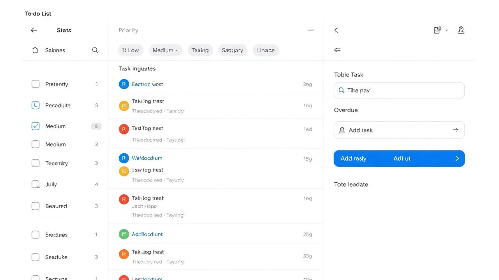
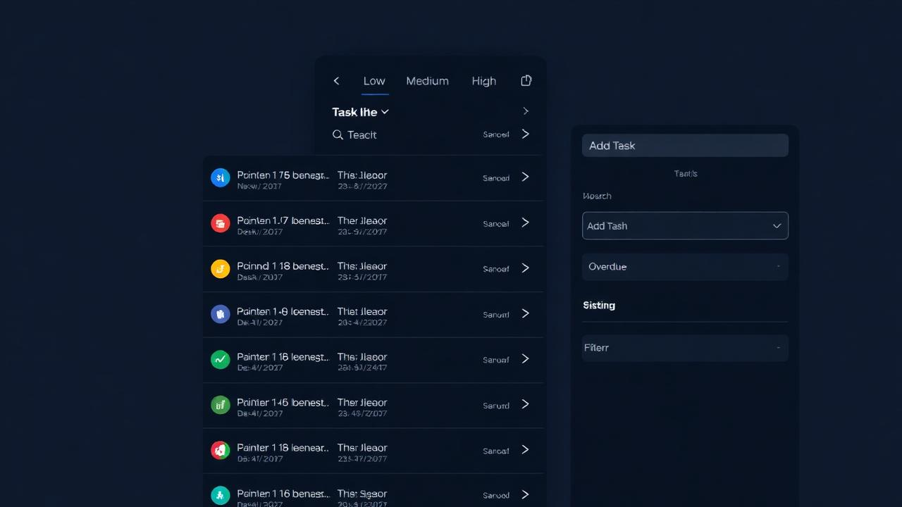

# To-Do List App – Tasks, Priorities, Deadlines

A beautiful, responsive To‑Do List application built with React, TypeScript, Tailwind, and shadcn‑ui. It features full CRUD, localStorage persistence, nested subtasks, drag‑and‑drop reordering, powerful filters and search, due dates with overdue alerts, dark mode toggle, and JSON import/export. Designed to be clean, modern, and recruiter‑friendly.

- Live demo: https://d904fd2f-b517-4c8a-800e-839bb901b6ab.lovableproject.com

## Screenshots

Light mode



Dark mode



## Features

- Full CRUD with localStorage persistence
- Nested subtasks (multi-level)
- Drag-and-drop reordering (tasks and subtasks)
- Prioritization (Low, Medium, High) with priority badges
- Due dates with visual overdue alerts
- Filter by status (All, Active, Completed, Overdue) and by priority
- Search by task title
- Sorting (Manual, Created, Due date, Priority, Title)
- JSON Import/Export for backup or migration
- Dark mode toggle with system preference detection
- Smooth animations and micro‑interactions
- Mobile‑first, responsive design

## Tech Stack

- React + Vite + TypeScript
- Tailwind CSS with semantic tokens
- shadcn‑ui components
- @dnd-kit for drag and drop
- react-helmet-async for SEO

## Getting Started

1. Install dependencies

```bash
npm i
```

2. Run the development server

```bash
npm run dev
```

3. Open the app

Visit the printed local URL. Changes update live.

## Usage

- Add a task via the top form; optionally set due date and priority
- Click task title to edit inline
- Check the box to complete a task
- Use the handle to drag and reorder
- Add subtasks via the + button on a task
- Filter, search, and sort from the toolbar
- Export to JSON (backup) or Import a JSON file to restore
- Toggle dark mode via the sun/moon button in the header

## Project Structure (key parts)

- src/features/todo/types.ts – Task types
- src/features/todo/storage.ts – localStorage load/save
- src/features/todo/TodoApp.tsx – App logic, filters, import/export
- src/features/todo/TaskTree.tsx – Recursive task list with DnD
- src/components/ThemeToggle.tsx – Dark mode toggle
- src/pages/Index.tsx – Page shell, SEO, app embedding

## SEO

- Title and meta description on the Index page
- Canonical link to avoid duplicates
- Semantic HTML structure (header, main)

## Future Improvements

- Reminders/notifications
- Inline rich text notes per task
- Bulk actions and multi‑select
- Keyboard shortcuts
- Cloud sync and auth (Supabase)
- Attachments via file uploads

## License

MIT
